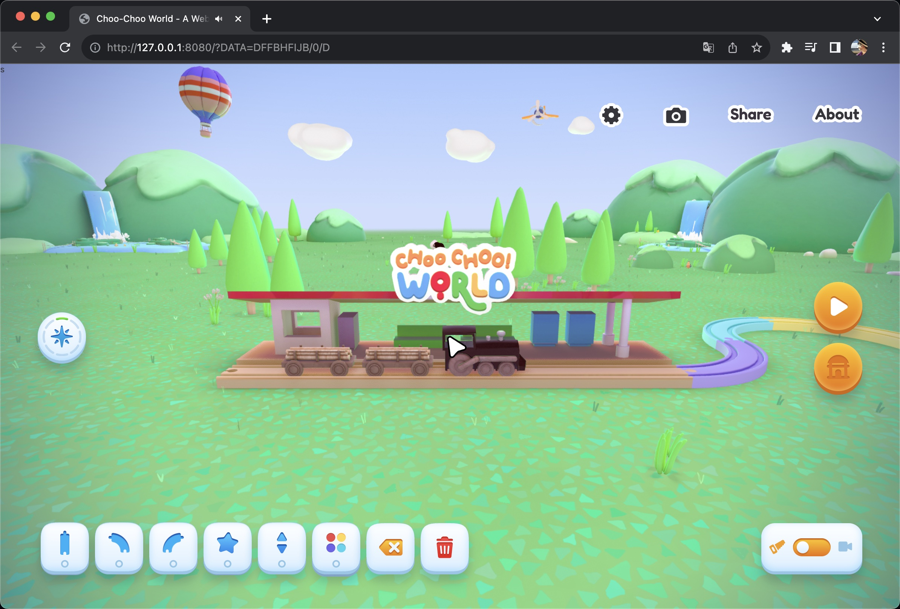

<div align="center">


 

---

Many amazing websites may disappear from the internet over time. That's why I created this repository to back up these sites for learning. For extremely large projects (over 100MB), separate storage repositories are created, while medium and small projects are categorized and stored in the 'pack' directory. The number of websites collected in this repository will be substantial, and I will continue to add more. Don't forget star this repo and upvote in ProductHunt.

<a href="https://www.producthunt.com/posts/awesome-sites?utm_source=badge-featured&utm_medium=badge&utm_souce=badge-awesome&#0045;sites" target="_blank"></a>

</div>

## Manual

Every collected websites have been tested and fixed, all can be running in localhost. After clone the repository enter the website's folder, simply start a local HTTP server such as `live-server`  to run the website offline.

for example
```node
clone git@github.com:ezshine/AwesomeSites-Pack01.git
cd ./AwesomeSites-Pack01/game/choochooworld.com/
live-server
```

## Contact Me

> If you have any fascinating websites you want to back up, please let me know and I can crawl them down for you.

| Twitter                                                                                                                                            | Wechat                                                                                                                                                                                |
| -------------------------------------------------------------------------------------------------------------------------------------------------- | ------------------------------------------------------------------------------------------------------------------------------------------------------------------------------------- |
| [](https://twitter.com/ezshine) | [](https://open.weixin.qq.com/qr/code?username=ezfullstack) |

## Video Channel

[](https://space.bilibili.com/422646817)


</p>

## Repositories

### Packs

> these website are already categorized.

#### AwesomeSites-Pack01

https://github.com/ezshine/AwesomeSites-Pack01

|||||
|-|-|-|-|
| [](https://github.com/ezshine/AwesomeSites-Pack01/tree/main/portfolio/bruno-simon.com) | [](https://github.com/ezshine/AwesomeSites-Pack01/tree/main/game/microwaver59.com) | [](https://github.com/ezshine/AwesomeSites-Pack01/tree/main/portfolio/david-hckh.com) | [](https://github.com/ezshine/AwesomeSites-Pack01/tree/main/game/therace.montblanclegend.com) |
| [](https://github.com/ezshine/AwesomeSites-Pack01/tree/main/portfolio/atmos.leeroy.ca)|[](https://github.com/ezshine/AwesomeSites-Pack01/tree/main/game/choochooworld.com)|[](https://github.com/ezshine/AwesomeSites-Pack01/tree/main/game/exp-my-little-storybook.lusion.co)|[](https://github.com/ezshine/AwesomeSites-Pack01/tree/main/other/turn-of-the-screw-trailer.s3.eu-west-2.amazonaws.com)|
|[](https://github.com/ezshine/AwesomeSites-Pack01/tree/main/car/exp-gemini.lusion.co)|[](https://github.com/ezshine/AwesomeSites-Pack01/tree/main/e-commerce/maxmara-bearinggifts.betteringbrands.com)|[](https://github.com/ezshine/AwesomeSites-Pack01/tree/main/exhibition/exp-infinite-passerella.lusion.co)|[](https://github.com/ezshine/AwesomeSites-Pack01/tree/main/other/yelloworld.pinkyellow.com)
|[](https://github.com/ezshine/AwesomeSites-Pack01/tree/main/car/www.lamborghini.com)|[](https://github.com/ezshine/AwesomeSites-Pack01/tree/main/game/guccibelovedbounce.gucci.com)|[](https://github.com/ezshine/AwesomeSites-Pack01/tree/main/game/www.foosballworldcup18.com)|[](https://github.com/ezshine/AwesomeSites-Pack01/tree/main/game/play.gl)|
|[](https://github.com/ezshine/AwesomeSites-Pack01/tree/main/room/hennessy-house-of-moves.hello-jury.com)|[](https://github.com/ezshine/AwesomeSites-Pack01/tree/main/portfolio/www.blues-d.co.jp)|[](https://github.com/ezshine/AwesomeSites-Pack01/tree/main/other/gleec.com)|[](https://github.com/ezshine/AwesomeSites-Pack01/tree/main/e-commerce/webxr-sneakers.lusion.co)|
|[](https://github.com/ezshine/AwesomeSites-Pack01/tree/main/room/showroom.littleworkshop.fr)|[](https://github.com/ezshine/AwesomeSites-Pack01/tree/main/room/au-floor.vercel.app)|[](https://github.com/ezshine/AwesomeSites-Pack01/tree/main/game/iwantitall.msi.com)|[](https://github.com/ezshine/AwesomeSites-Pack01/tree/main/game/www.chocapic-nutri-game.fr)|
|[](https://github.com/ezshine/AwesomeSites-Pack01/tree/main/game/kodingergoy.arkivert.no)|[](https://github.com/ezshine/AwesomeSites-Pack01/tree/main/portfolio/interview.ueno.co)|[](https://github.com/ezshine/AwesomeSites-Pack01/tree/main/portfolio/madbox.io)|[](https://github.com/ezshine/AwesomeSites-Pack01/tree/main/other/avatarbuilder)|
|[](https://github.com/ezshine/AwesomeSites-Pack01/tree/main/other/lucyhardcastle-thefifthsense.i-d.co)|[](https://github.com/ezshine/AwesomeSites-Pack01/tree/main/other/wildflower.resn.co.nz)|[](https://github.com/ezshine/AwesomeSites-Pack01/tree/main/car/toyotagazooracing.com)|[](https://github.com/ezshine/AwesomeSites-Pack01/tree/main/car/www.vw.com.mx)|

- [eyes.nasa.gov](https://eyes.nasa.gov)
- [robertsspaceindustries.com/starmap](https://robertsspaceindustries.com/starmap)
- [www.fendi.com/baguette25](https://www.fendi.com/baguette25)
- [njcb.gotin.online](https://njcb.gotin.online)

#### AwesomeSites-Pack02

https://github.com/ezshine/AwesomeSites-Pack02

|||||
|-|-|-|-|
| [](https://github.com/ezshine/AwesomeSites-Pack02/tree/main/game/letsplay.ouigo.com) |[](https://github.com/ezshine/AwesomeSites-Pack02/tree/main/game/slowroads) |[](https://github.com/ezshine/AwesomeSites-Pack02/tree/main/game/playyourpower.narscosmetics.com) |[](https://github.com/ezshine/AwesomeSites-Pack02/tree/main/game/truesource.evian.com) |
[](https://github.com/ezshine/AwesomeSites-Pack02/tree/main/room/adobexbowie75.com) |[](https://github.com/ezshine/AwesomeSites-Pack02/tree/main/car/vrshow-oss.dt-space.cn/showroom) |[](https://github.com/ezshine/AwesomeSites-Pack02/tree/main/other/webgi-jewelry.vercel) |[](https://github.com/ezshine/AwesomeSites-Pack02/tree/main/other/lr.doesbook.kr/en) |

- [exp-abduction.lusion.co](https://exp-abduction.lusion.co)
- [media-facade.shiftlink.tech](https://media-facade.shiftlink.tech)
- [neal.fun/design-the-next-iphone](https://neal.fun/design-the-next-iphone)
- [ellometay33art](https://ellometay33art)
- [www.thepleasurepursuit.com](https://www.thepleasurepursuit.com)
- [bmwspace](https://bmwspace)
- [wonderland](https://wonderland)
- [vrseat.vercel](https://vrseat.vercel)
- [www.thefemalegaze.art](https://www.thefemalegaze.art)

#### AwesomeSites-Pack03

https://github.com/ezshine/AwesomeSites-Pack03

- [www.hape.io](https://www.hape.io)
- [cleo.show](https://cleo.show)
- [futureofbeauty.loreal.com](https://futureofbeauty.loreal.com)
- [sigmasoftwarelabs.com](https://sigmasoftwarelabs.com)
- [renaudrohlinger.com](https://renaudrohlinger.com)
- [party.wearezizo.com](https://party.wearezizo.com)
- [akinokogomi.vercel.app/](https://akinokogomi.vercel.app/)
- [wearezizo.com](https://wearezizo.com)
- [rainforest.arkivert.no](https://rainforest.arkivert.no)
- [coastalworld.com](https://coastalworld.com)
- [technology.panasonic.eu](https://technology.panasonic.eu)
- [popmart2022](https://popmart2022)
- [oppo_innoday2021](https://oppo_innoday2021)

#### AwesomeSites-Pack04

https://github.com/ezshine/AwesomeSites-Pack04

- [www.baiweimeta.cn](https://www.baiweimeta.cn)
- [meta2022.worldaic.com.cn](https://meta2022.worldaic.com.cn)
- [www.girlswhocodegirls.com](https://www.girlswhocodegirls.com)
- [summer-afternoon.vlucendo.com](https://summer-afternoon.vlucendo.com)
- [out-of-doors.lostmechanics.com](https://out-of-doors.lostmechanics.com)
- [www.spaceforce.com](https://www.spaceforce.com)
- [howls.loewe.com](https://howls.loewe.com)
- [hle.io](https://hle.io)
- [www.spaceforce.com](https://www.spaceforce.com)
- [www.theperfumeshop.com](https://www.theperfumeshop.com)
- [af1hotel.koikreative.com](https://af1hotel.koikreative.com)
- [http://www.heyzxz.me/pcol](http://www.heyzxz.me/pcol)
- [haunted.thedigitalpanda.com](http://haunted.thedigitalpanda.com)
- [fragrance.hermes.com](fragrance.hermes.com)
- [veecon2023game.veefriends.com](veecon2023game.veefriends.com)
- [impossible-box.web.app](impossible-box.web.app)
- [thewebshowcase.withgoogle.com](thewebshowcase.withgoogle.com)
- [thefabulouscartierjourney.cartier.com](thefabulouscartierjourney.cartier.com)
- [colorfulnight.pha5e.com](colorfulnight.pha5e.com)

### Independent

> these website are bigger than 100MB, so i create independent repository for them.

#### leap-for-mankind.com
[](https://github.com/ezshine/AwesomeSites-leap-for-mankind.com)

#### persepolis.getty.edu
[](https://github.com/ezshine/AwesomeSite-persepolis.getty.edu)


#### dddance.party
[](https://github.com/ezshine/AwesomeSite-dddance.party)


#### 同济大学设计创意学院2022毕展
[](https://github.com/ezshine/AwesomeSites-tjdi-exhibition)


#### 抖音汽车嘉年华2022
[](https://github.com/ezshine/AwesomeSites-douyin_carnival_2022)


#### themagicalpantry.com
[](https://github.com/ezshine/AwesomeSites-themagicalpantry.com)


#### 工商银行元宇宙2022
[](https://github.com/ezshine/AwesomeSites-icbc-bj-metaverse)


#### iconicmints.wsjbarrons.com
[](https://github.com/ezshine/AwesomeSites-iconicmints.wsjbarrons.com)

